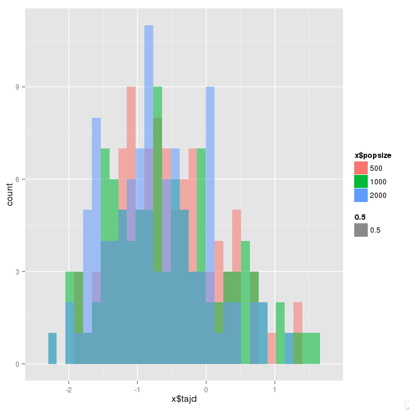
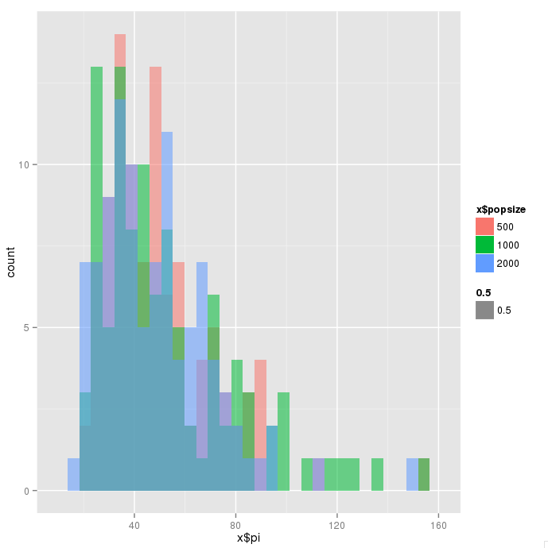
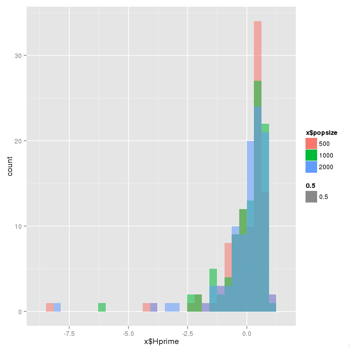

## Todo

install and use https://github.com/rossibarra/msstatsFST instead of standard msstats

## Example runs 

- ./sfs_code 1 1 -n 17 --popSize 500 -r 0.01 -t 0.01 -Td 0 0.8 -Tg 0 60 -TE 0.067 --length 1 10000 --annotate N
- /sfs_code 1 1 -n 17 --popSize 500 -r 0.01 -t 0.01 -Td 0 0.8 -Tg 0 60 -TE 0.067 --length 1 10000 --annotate C --selDistType 2 0 blah blah 1 X

## Params

### Draw from distribution but not do ABC:

- theta ( -t X )
 	- draw from observed values of teosinte pi from Hufford et al. 2012

- rho: set equal to theta

### Do ABC

- bottleneck size ( -Td 0 P 1 X )
	- start w/ X~runif(1,0,1)

- mean of exponential for selection --selDistType 2 0 blah blah 1 X 
	- start with X~runif(1,0,1)

### Try a few different values but no ABC 

- -Tg 0 P 1 alpha; use final pop size such that alpha=log(X/150000)/(0.03333333) where X is final pop size
- try final popsizes of 10^5, 10^7, 10^9

## Popsize check for paranoia

### ABCreg notes
- automatically create data and prior files from simulated stats and data
- integrate this into cleanup.sh
- rethink the organization of the because that's silly

### Boosting
- incorporate boosting
- doesn't seem like we can take Aeschbacher's scripts wholesale.
- create R scripts using package "mboost" to integrate boosting
- local L2 selection is best (Aeschbacher et al 2012)
- pipline something like this:
maize_bs.sh -> cleanup.sh -> ABCreg_setup.sh -> ./ABCreg -> boost.R -> stop, look at posterior -> if good talk to Jeff, if bad adjust parameter distribution to be from min(good_summary_stats_parameters) to max(good_summary_stats_parameters) and run maize_bs.sh again
- this might be folly if there are values inside the new parameter dist for which the resulting posterior is bad. i.e. there are multiple parameter disributions that don't overlap. 